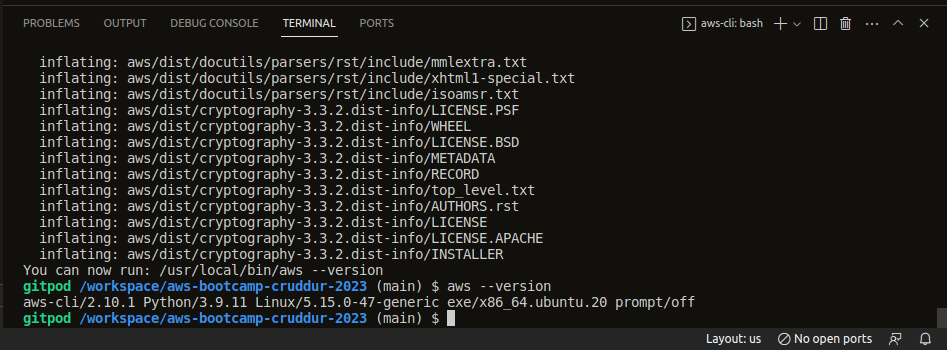
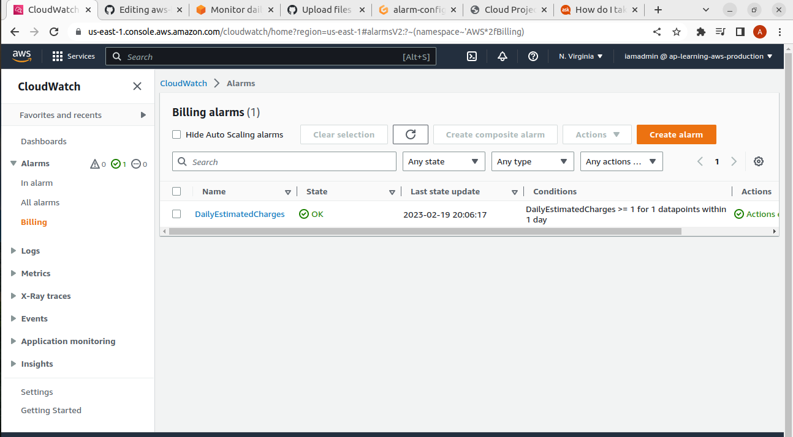

# Week 0 — Billing and Architecture

## Required Homework

### Install AWS CLI

#### Installed AWS CLI

[Proof of AWS CLI installation ](https://github.com/PentakotaAnand/aws-bootcamp-cruddur-2023/blob/main/.gitpod.yml)

### Create Billing Alarm

[Billing Alarm Configuration](https://github.com/PentakotaAnand/aws-bootcamp-cruddur-2023/blob/main/aws/json/alarm-config.json)

### Create AWS Budget

One cost budget created with a budget amount of 1$

[Cost Budget Configuration](https://github.com/PentakotaAnand/aws-bootcamp-cruddur-2023/blob/main/aws/json/budget.json)

### Architectural diagram

[Lucid Chart Link for architecture diagram](https://lucid.app/lucidchart/59f6f12f-7136-4b49-82b8-6ae095cae6d3/edit?viewport_loc=-924%2C180%2C3108%2C1590%2C0_0&invitationId=inv_3ec383e5-01b7-40db-a972-4e8476eea475)

