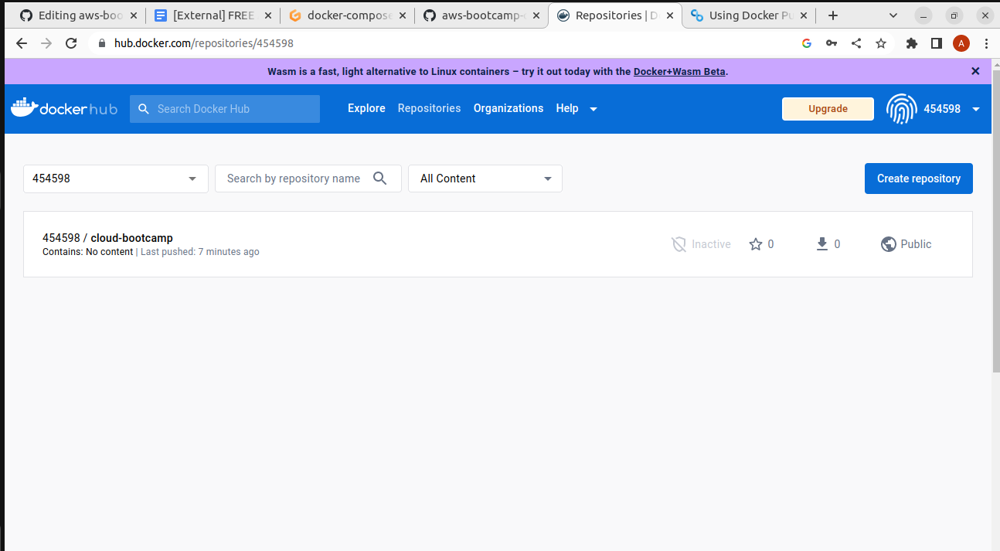

# Week 1 — App Containerization

## Required Homework Challenges

### 1. Run the dockerfile CMD as an external script


### 2. Push and tag a image to DockerHub (they have a free tier)
Initally I tagged the image and tried to push to my dockerhub account it failed with error ```denied: requested access to the resource is denied```
Then i realized that i have to login to dockerhub account from local.



Tagged the image as ``` docker tag hello-world 454598/cloud-bootcamp:first-image```


The image pushed to my docker account


